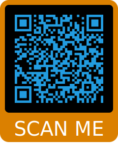
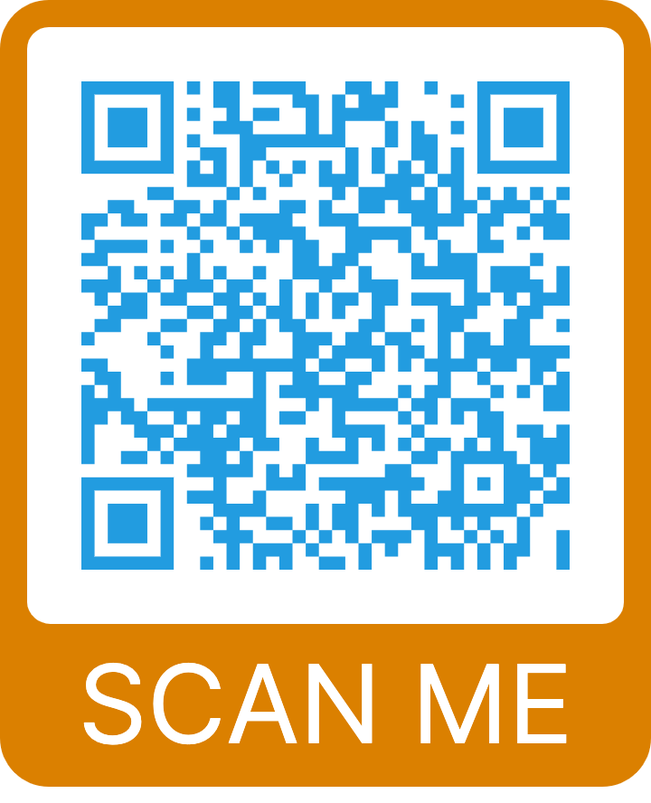
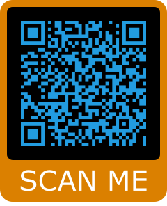
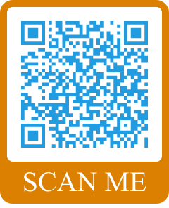
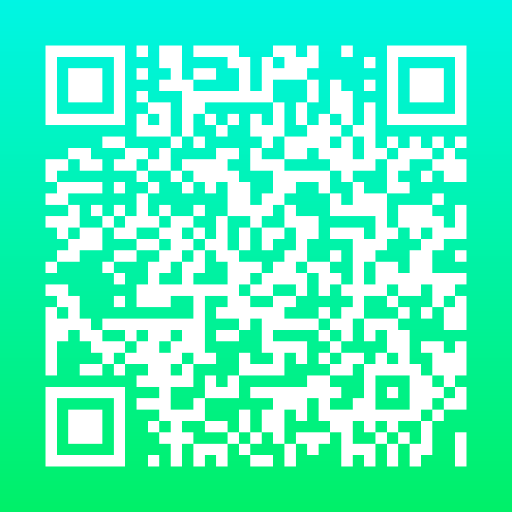
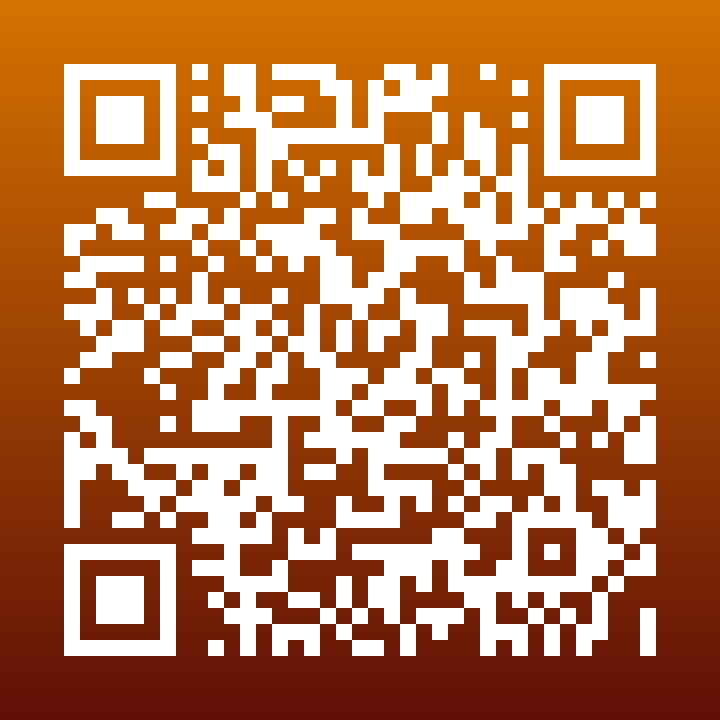
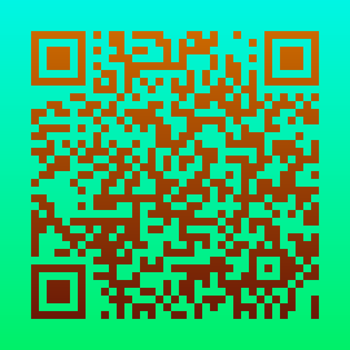
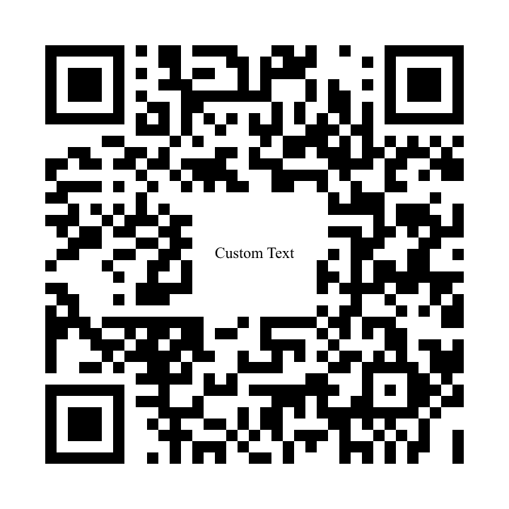
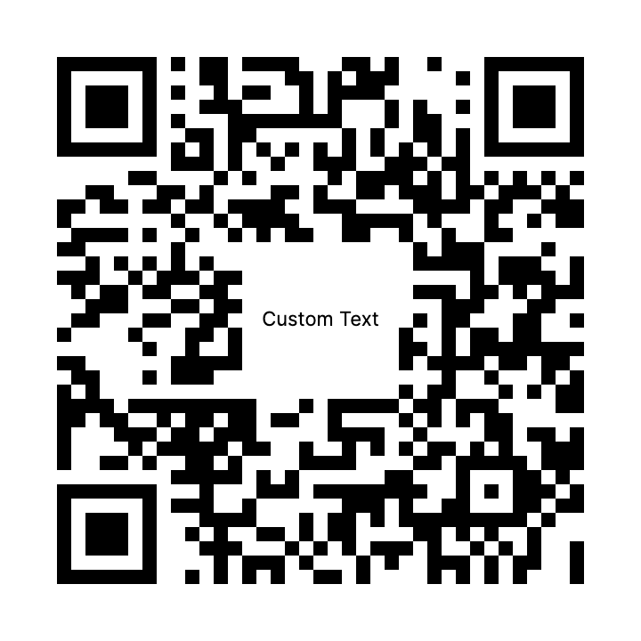

# qr_code_rasterization_test

## Prerequisites

You will need to download these external CLI programs for this to run successfully.

- `brew install imagemagick`
- `brew install resvg`
- `npm install -g convert-svg-to-png`

## Run

- `go build rasterization`
- `./rasterization`

## Output

Look in the `output/` folder to find the pngs created and compare them to the originals from the `compare/` directory (values from the compare directory have been copied into the output directory for convenience)

## comparison
name | input | expected | cons2p | chrome | oksvg | imagemagick | resvg
-----------------------------------------------------------------------
frame.svg |  |  |  |  |  |  | 
gradient.svg |  |  |  |  |  |  | 
text.svg |  |  |  |  |  |  | 
-----------------------------------------------------------------------